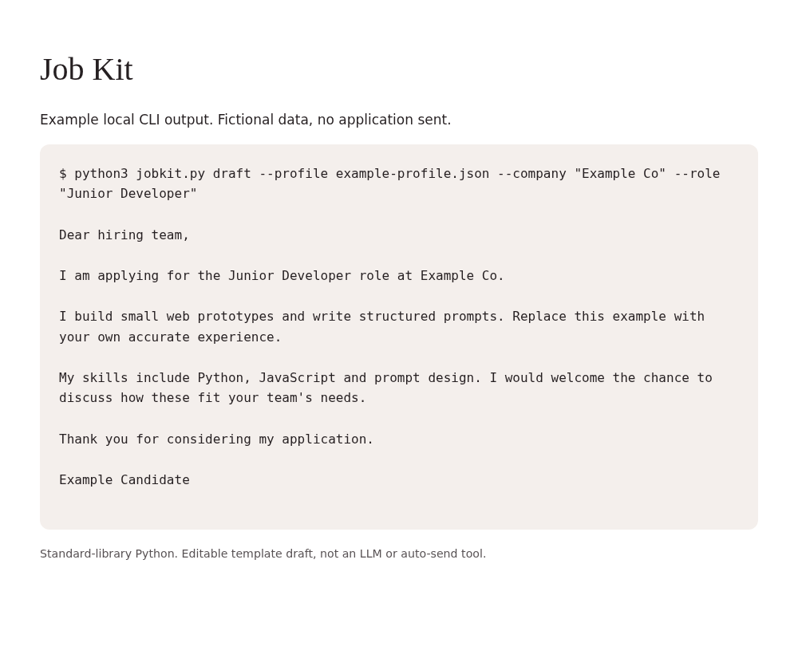

# Job Kit

Local Python cover-letter draft helper and CSV application tracker. No email access or auto-send.

## Status and authorship

An original, AI-assisted prototype prepared for Rahul Kumar's portfolio. It is not copied from another project and is not a claim of production deployment, independent manual authorship, or paid AI-model integration. The examples are fictional.

## Run locally

Requires Python 3.9+ only. No pip packages or API keys.

## Use

```sh
python3 jobkit.py draft --profile example-profile.json --company "Example Co" --role "Junior Developer"
python3 jobkit.py track --company "Example Co" --role "Junior Developer" --status planned --url "https://example.com"
python3 -m unittest -v
```

Copy example-profile.json to a private file and replace every claim with your own accurate facts. Review draft letters before using them.

## Limits

Template-based, not an LLM. Does not read your inbox, browse jobs, submit applications or tailor claims to a job description. Tracker appends a row; it does not update/deduplicate older rows.

## Privacy and cost

No API keys, paid services, tracking, telemetry or network calls are required. All inputs stay on your device. Keep real resumes and application data out of public repositories and shared computers.

## Checks

Eight standard-library unit tests cover profile validation, draft facts, tracker headers/appends, invalid status and spreadsheet formula protection. Run `python3 -m unittest -v`.

## Next steps

Improve accessibility testing, add more examples and collect real-user feedback. No external contribution history or user numbers are claimed.


